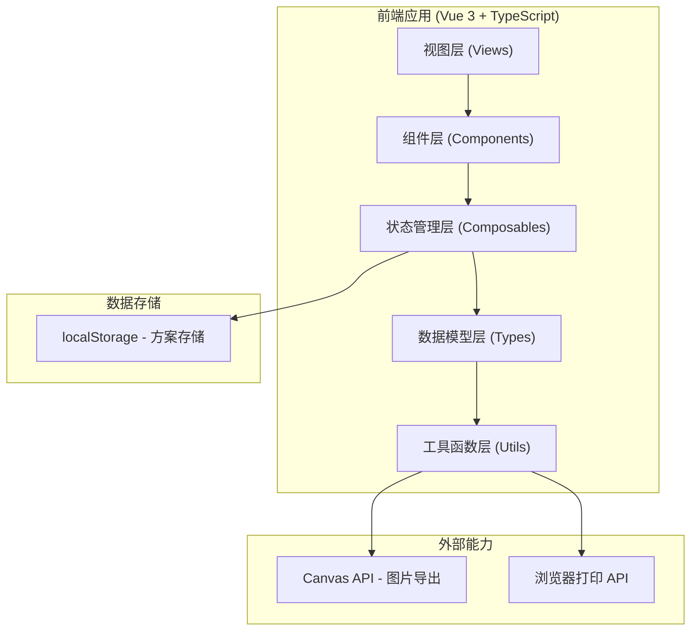

# 古礼席位摆放与仪程卡预演器 - 技术架构文档

## 1. 架构设计



## 2. 技术描述

- **前端框架**：Vue 3 + TypeScript + Composition API
- **构建工具**：Vite 5
- **样式方案**：Tailwind CSS 3
- **状态管理**：Vue Composition API + reactive/ref（轻量级场景，无需 Pinia）
- **拖拽实现**：原生 HTML5 Drag and Drop API + 自定义拖拽逻辑
- **画布渲染**：SVG（便于矢量导出和事件处理）
- **图片导出**：html2canvas 或 SVG 转 Canvas
- **数据存储**：localStorage
- **图标**：Lucide Icons

## 3. 模块划分

| 模块 | 路径 | 职责 |
|------|------|------|
| 主工作台 | `src/views/Workspace.vue` | 主页面布局，整合各子组件 |
| 场景选择器 | `src/components/SceneSelector.vue` | 场景切换、模板加载 |
| 器物素材库 | `src/components/MaterialLibrary.vue` | 素材分类展示、拖拽源 |
| 席面画布 | `src/components/SeatingCanvas.vue` | 俯视图画布、元素拖拽摆放 |
| 流程图视图 | `src/components/FlowChartView.vue` | 流程图方式展示礼序 |
| 礼序步骤栏 | `src/components/CeremonySteps.vue` | 步骤列表、当前步骤高亮 |
| 方案管理 | `src/components/SchemeManager.vue` | 保存、加载、删除方案 |
| 打印预览 | `src/components/PrintPreview.vue` | 仪程卡预览和打印 |
| 元素编辑器 | `src/components/ElementEditor.vue` | 选中元素的属性编辑面板 |

## 4. 数据模型定义

### 4.1 核心类型定义

```typescript
// 礼仪场景类型
type CeremonyScene = 'welcome' | 'tea' | 'capping' | 'sacrifice'

// 元素类型
type ElementType = 
  | 'seat-main'      // 主位
  | 'seat-guest'     // 宾位
  | 'seat-secondary' // 次宾位
  | 'table'          // 案几
  | 'mat'            // 席垫
  | 'vessel-tea'     // 茶盏
  | 'vessel-wine'    // 酒爵
  | 'vessel-water'   // 沃盥器
  | 'vessel-fruit'   // 果盘
  | 'incense'        // 香炉
  | 'candle'         // 烛台

// 画布元素
interface CanvasElement {
  id: string
  type: ElementType
  x: number
  y: number
  width: number
  height: number
  rotation: number
  label: string
  role?: string     // 角色名称，如"主人"、"宾客"
  zIndex: number
}

// 礼序步骤
interface CeremonyStep {
  id: string
  order: number
  title: string
  description: string
  direction?: string      // 行礼方向
  involvedElements: string[]  // 涉及的元素 ID
  deliveryRoute?: {
    from: string
    to: string
    item: string
  }
  duration?: string  // 建议时长/节拍
}

// 礼序模板
interface CeremonyTemplate {
  scene: CeremonyScene
  name: string
  description: string
  steps: CeremonyStep[]
  defaultElements: CanvasElement[]
}

// 保存的方案
interface CeremonyScheme {
  id: string
  name: string
  scene: CeremonyScene
  createdAt: number
  updatedAt: number
  elements: CanvasElement[]
  currentStepIndex: number
}
```

### 4.2 数据存储

所有方案数据保存在 localStorage 中，key 为 `ancient-ceremony-schemes`。

## 5. 工具函数

| 函数名 | 路径 | 功能 |
|--------|------|------|
| `generateId` | `src/utils/id.ts` | 生成唯一 ID |
| `exportCanvasAsImage` | `src/utils/export.ts` | 导出画布为图片 |
| `generatePrintCard` | `src/utils/print.ts` | 生成打印仪程卡 |
| `schemeStorage` | `src/utils/storage.ts` | localStorage 方案存取 |
| `ceremonyTemplates` | `src/data/templates.ts` | 四种场景的预设模板数据 |

## 6. 目录结构

```
src/
├── components/
│   ├── CanvasElement.vue
│   ├── CeremonySteps.vue
│   ├── ElementEditor.vue
│   ├── FlowChartView.vue
│   ├── MaterialLibrary.vue
│   ├── PrintPreview.vue
│   ├── SceneSelector.vue
│   ├── SchemeManager.vue
│   └── SeatingCanvas.vue
├── composables/
│   ├── useCeremony.ts
│   ├── useDragDrop.ts
│   └── useScheme.ts
├── data/
│   └── templates.ts
├── types/
│   └── index.ts
├── utils/
│   ├── export.ts
│   ├── id.ts
│   ├── print.ts
│   └── storage.ts
├── views/
│   └── Workspace.vue
├── App.vue
├── main.ts
└── style.css
```
